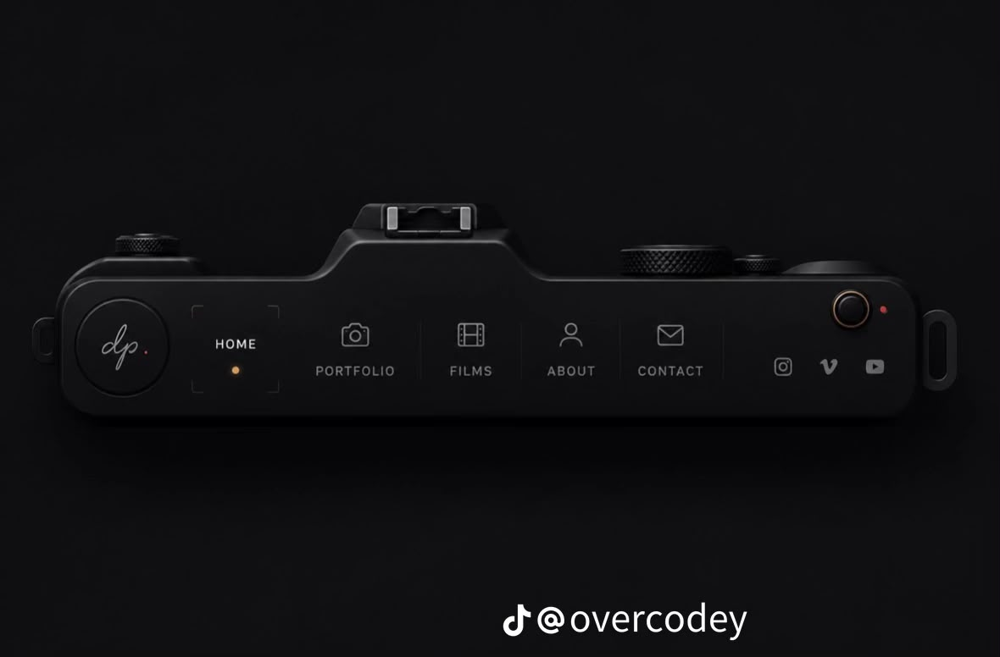

# 📸 Camera Navbar — Photography Portfolio Website

A creative, fully responsive photography portfolio website featuring a **unique camera-shaped navigation bar**. The navbar is designed to look like a real camera body, complete with knobs, a hot shoe mount, and an indicator light — making it a standout UI concept for photographer portfolios.



## 🔗 Live Demo

👉 **[View Live Site](https://hathisathissara.github.io/camera-navbar/)**

## ✨ Features

- **Camera-Shaped Navbar** — A fully custom navigation bar styled to resemble a real camera body, with decorative knobs, hot shoe mount, and indicator light
- **Dark Cinematic Theme** — Premium dark mode design with subtle glass effects and elegant typography
- **Smooth Scroll Navigation** — Active link highlighting based on scroll position with smooth transitions
- **Scroll Reveal Animations** — Staggered fade-in animations for portfolio items, film cards, and contact sections
- **Responsive Design** — Fully responsive layout with hamburger menu for mobile devices
- **Portfolio Grid** — Masonry-style image grid with hover overlay effects
- **Cinematic Film Cards** — Video showcase section with play buttons and duration badges
- **Contact Form** — Functional contact form with animated success feedback
- **Social Media Integration** — Instagram, Vimeo, and YouTube icon links

## 🛠️ Tech Stack

| Technology | Usage |
|---|---|
| **HTML5** | Semantic structure & SEO |
| **CSS3** | Custom styling, animations, glassmorphism |
| **Vanilla JavaScript** | Scroll events, IntersectionObserver, form handling |
| **Google Fonts** | Inter & Playfair Display typography |
| **Unsplash** | High-quality portfolio images |

## 📁 Project Structure

```
camera-navbar/
├── index.html      # Main HTML file with all sections
├── style.css       # Complete styling with animations & responsiveness
├── script.js       # Navigation, scroll effects & form logic
├── image.jpeg      # Preview image
└── README.md       # Project documentation
```

## 🚀 Getting Started

1. **Clone the repository**
   ```bash
   git clone https://github.com/hathisathissara/camera-navbar.git
   ```

2. **Open the project**
   ```bash
   cd camera-navbar
   ```

3. **Run locally**
   - Simply open `index.html` in your browser
   - Or use a live server extension (e.g., VS Code Live Server)

## 📸 Sections

| Section | Description |
|---|---|
| **Hero** | Full-screen hero with "Visual Storytelling" headline and CTA buttons |
| **Portfolio** | Masonry grid showcasing landscape, portrait, street, nature & travel photography |
| **Films** | Cinematic reel cards with play buttons and genre tags |
| **About** | Photographer bio with experience stats |
| **Contact** | Contact form with email, phone, and location info cards |

## 🎨 Design Highlights

- **Glassmorphism** — Semi-transparent navbar with backdrop blur
- **Custom SVG Icons** — Hand-crafted navigation and social media icons
- **Micro-Animations** — Hover effects, scroll reveals, and staggered transitions
- **Color Palette** — Dark background (`#0a0a0a`) with warm amber accents (`#d4a853`)

## 📄 License

This project is open source and available under the [MIT License](LICENSE).

## 🤝 Connect

- **GitHub**: [@hathisathissara](https://github.com/hathisathissara)

---

⭐ If you found this project interesting, give it a star!
